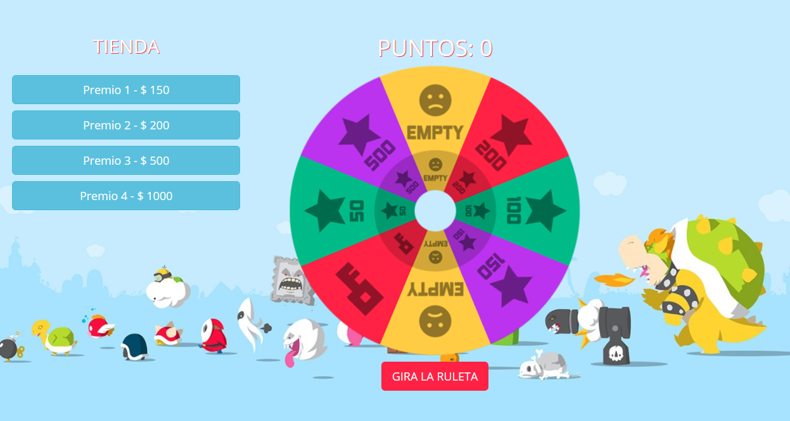

Este es un proyecto personal que está implementado utilizando la librería ReactJS de facebook [Juego de la ruleta](https://diegojs.github.io/game-react/).

Install:

1. git clone git@github.com:DiegoJS/game-react.git
2. cd game-react
3. npm install
4. npm start

License:

The content of this project itself is licensed under the Creative Commons Attribution 3.0 license, and the underlying source code used to format and display that content is licensed under the MIT license.

Developers

Diego JD.
